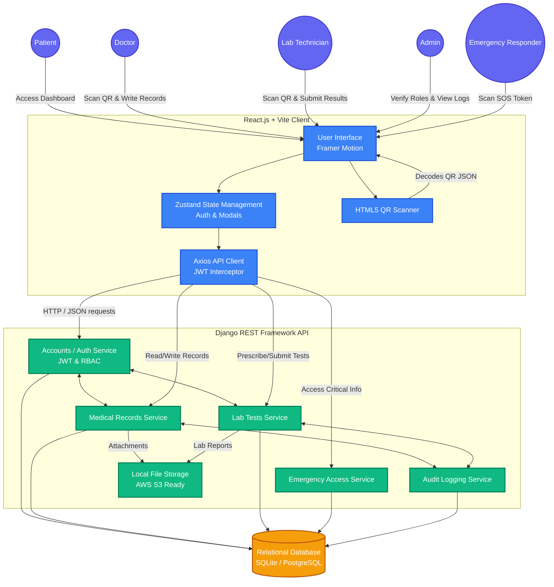

# Bionex Healthcare Platform: System Architecture

This document outlines the high-level system architecture, technology stack, and component interactions for the Bionex Healthcare Platform.

## 1. High-Level Architecture Diagram

The platform follows a decoupled client-server architecture where the React frontend communicates with the Django REST API over HTTP/REST protocols.

---

## 2. Component Breakdown

### Frontend (Client-Side)
- **Framework:** React.js initialized with Vite for rapid Hot Module Replacement (HMR) and optimized production builds.
- **Language:** TypeScript for strict type checking, preventing runtime errors related to complex medical data structures.
- **State Management:** `Zustand` is utilized for lightweight, global state management, specifically handling the authentication state (`authStore`) and storing the user profile context.
- **API Client:** `Axios` is configured with request and response interceptors. It automatically attaches JWT access tokens to secure requests and silently refreshes tokens in the background if they expire.
- **Styling:** Centralized CSS variables architecture (`index.css`) supporting dynamic theming (Light/Dark mode) with native CSS variables.
- **Animations:** `Framer Motion` powers the immersive, premium micro-animations (e.g., page transitions, modal pop-ups, scanner visualizations).
- **Scanner:** `html5-qrcode` library captures camera feeds to decode encrypted or stringified Bionex UUID JSON payloads.

### Backend (Server-Side)
- **Framework:** Django combined with Django REST Framework (DRF) provides a highly secure, ORM-backed REST API.
- **Authentication:** `djangorestframework-simplejwt` provides stateless JSON Web Tokens. Access tokens are short-lived, while refresh tokens securely extend sessions.
- **Role-Based Access Control (RBAC):** Custom Django permission classes ensure that API endpoints are rigidly locked down. (e.g., Only an approved doctor can write to the `Records` app).
- **Audit Logging:** Every critical action (viewing a record, scanning a patient, verifying a doctor) triggers a signal that writes an immutable record to the `Audit` app.

### Database
- **Engine:** SQLite for local development (easily migratable to PostgreSQL for production environments).
- **Schema Focus:** Highly relational structure connecting the core custom `User` model to `DoctorProfile`, `LabProfile`, `MedicalRecord`, and `LabTest` entities.

### File Storage
- **Media System:** Django's native storage backend handles file attachments (prescriptions, lab reports, avatar images). Files are served dynamically.

---

## 3. Core Interaction Workflows

### The Scanning Workflow (Doctor / Lab Tech)
1. The **Actor** opens the scanner via the UI.
2. The **Scanner Component** accesses the device camera and decodes the patient's QR code.
3. The UI parses the `{"health_id": "MID-XXXX-XXXX"}` JSON payload.
4. The **Axios Client** sends a search query to the backend.
5. The **Backend** validates the Doctor/Lab Tech's authorization, logs the access event in the **Audit DB**, and returns the patient data.

### The Emergency Workflow
1. A bystander or paramedic scans a patient's **Emergency SOS QR Code**.
2. The user is redirected to the `/emergency/:token` public route.
3. The frontend passes the encrypted token to the **Emergency Service** API.
4. The backend decrypts the token, validates its expiry, and returns only critical, life-saving information (blood type, allergies) without requiring a login.
