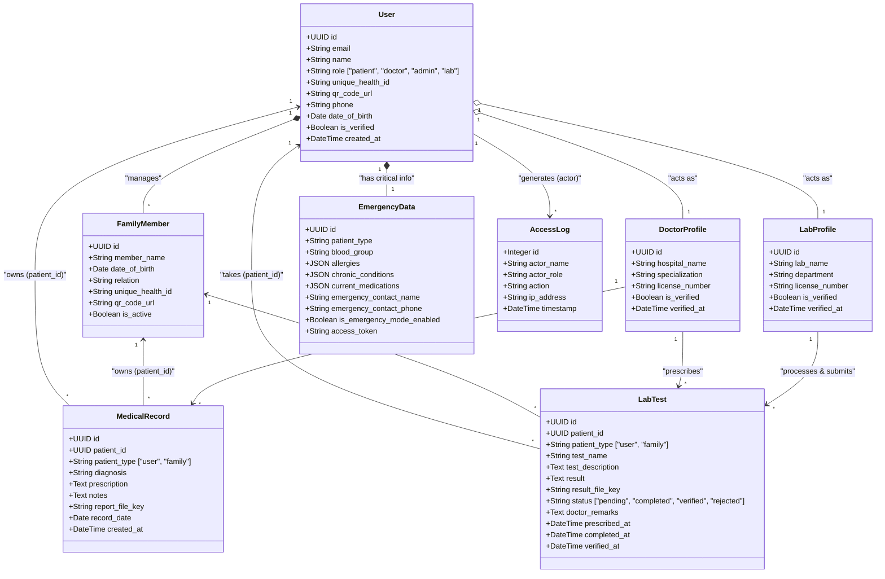

# Bionex Healthcare Platform: UML Database Schema

This UML Class Diagram illustrates the core relational database schema, detailing the key entities, their attributes, and how they interact within the Bionex platform.

### UML Relationship Key:
*   `*--` (Composition): A strong lifecycle dependency (e.g., if a User is deleted, their Family Members are deleted).
*   `o--` (Aggregation): A weaker dependency linking a base user to a specific role profile.
*   `-->` / `<--` (Directed Association): Denotes actions and references (e.g., A Doctor creates a Medical Record).
*   `"1" to "*"`: Indicates a One-to-Many relationship.
*   `"1" to "1"`: Indicates a One-to-One relationship.
